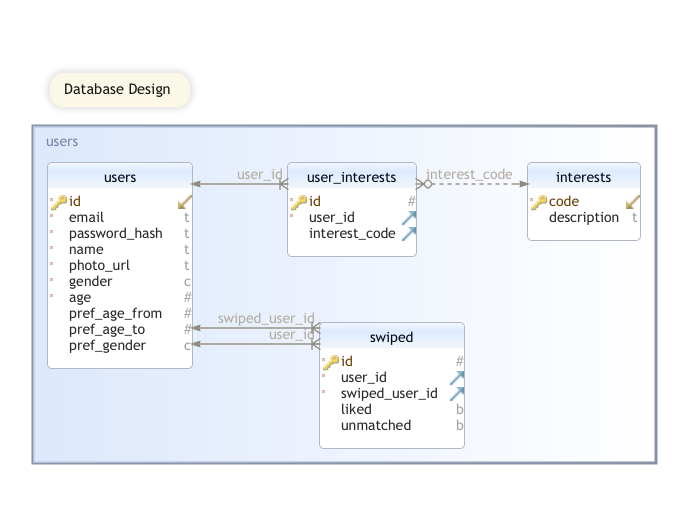

# General Assembly: Project 4: CupidREACT.
**Cupid is an online dating site. Similar to Tinder/Bumble** 

**Cupid functions**
- Register
- Login
- Update profile
- Add/update interests
- Like/Unlike possible matches
- View current matches
- Unmatch a match
- Delete account

## URL
https://infinite-everglades-67741.herokuapp.com/

## Github
https://github.com/elevin-bot/cupidREACT

## Technologies Used
- REACT
- HTML
- CSS
- Javascript
- NodeJS
- ExpressJS
- Axios
- PostgresSQL
- Heroku hosting
- Bcrypt for password encryption
- Github

## Installation
No installation required. Just click on the URL.

## Database design

## Future Updates
- Allow user to select and upload photos, and store them in Amazon S3 bucket (cloud object storage)

## Engineers
- Eugene Levin